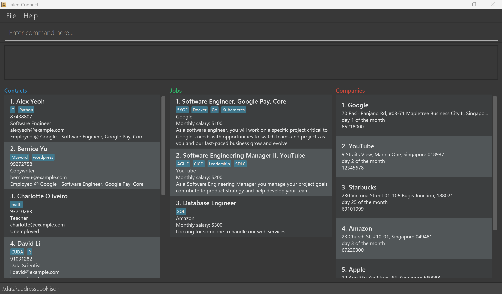
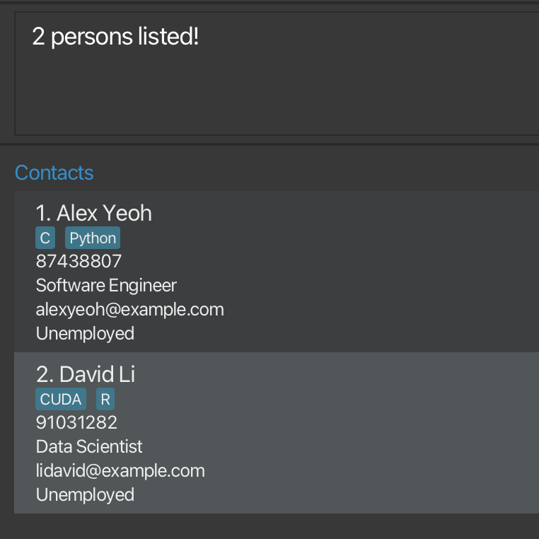
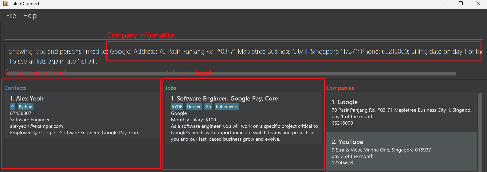

TalentConnect is a **desktop app catered to third-party recruiters, optimized for use via a Command Line Interface** (CLI) 
while still having the benefits of a Graphical User Interface (GUI). It boasts specialised features for 
managing your candidates, jobs, and companies, to help elevate your work in recruitment.
If you can type fast, TalentConnect can help you complete your recruitment management tasks 
faster than traditional GUI apps.

* Table of Contents
{:toc}

--------------------------------------------------------------------------------------------------------------------

## Quick start

1. Ensure you have Java `17` or above installed in your Computer.

2. Download the latest `.jar` file from [here](https://github.com/AY2425S1-CS2103-F13-4/tp/releases).

3. Copy the file to the folder you want to use as the _home folder_ for your TalentConnect.

4. Open a command terminal, `cd` into the folder you put the jar file in, and use the `java -jar talentconnect.jar` command to run the application. 
   A GUI similar to the below should appear in a few seconds. Note how the app contains some sample data. 
   

5. Type the command in the command box and press Enter to execute it. e.g. typing **`help`** and pressing Enter will open the help window. 
   Some example commands you can try:

   * `list contact` : Lists all contacts.

   * `add contact n/John Doe p/98765432 e/johnd@example.com r/Software Engineer` : Adds a contact named `John Doe` to the Address Book.

   * `delete contact 3` : Deletes the 3rd contact shown in the current list.

   * `clear` : Deletes all contents in the address book.

   * `exit` : Exits the app.

6. Refer to the [Features](#features) below for details of each command.

--------------------------------------------------------------------------------------------------------------------

## Features

**:information_source: Notes about the command format:** 

* Words in `UPPER_CASE` are the parameters to be supplied by the user. 
  e.g. in `add contact n/NAME`, `NAME` is a parameter which can be used as `add contact n/John Doe`.

* Commands, not including their parameters, are case-insensitive. 
  e.g. if the command specifies `adD CONTact ...`, it will be interpreted as `add contact ...`. 
 
* `lowercase` items in square brackets are mandatory keyword, separated by slashes.  
  e.g. `add [contact/job/company]` can be used as  `add contact n/...` or as `add job n/...`, but not `add n/...`.

* `UPPER_CASE` items in square brackets are optional parameters. 
  e.g. `n/NAME [s/SKILL]` can be used as `n/John Doe s/Python` or as `n/John Doe`.

* Items with `…`​ after them can be used multiple times including zero times. 
  e.g. `[s/SKILL]…​` can be used as ` ` (i.e. 0 times), `s/Python`, `s/Python s/Cuda` etc.

* Parameters can be in any order. 
  e.g. if the command specifies `n/NAME p/PHONE`, `p/PHONE n/NAME` is also acceptable.

* Extraneous parameters for commands that do not take in parameters (such as `help`, `exit` and `clear`) will be ignored. 
  e.g. if the command specifies `help 123`, it will be interpreted as `help`.

* If you are using a PDF version of this document, be careful when copying and pasting commands that span multiple lines as space characters surrounding line-breaks may be omitted when copied over to the application.

### Viewing help : `help`

Shows a message explaining how to access the help page.

Format: `help`

### Adding a contact : `add contact`

Adds a contact to the address book.

Format: `add contact n/NAME p/PHONE e/EMAIL r/ROLE [s/SKILL]…​`

* A contact's role represents the job that they are applying for, 
and is used when screening contacts with a certain job.

:bulb: **Tip:**
A contact can have any number of skills (including 0)

Examples:
* `add contact n/John Doe p/98765432 e/johnd@example.com r/Software Engineer`
* `add contact n/Betsy Crowe s/Python e/betsycrowe@example.com r/Data Scientist p/1234567 s/Excel`

### Adding a job : `add job`

Adds a job to the address book. 
The company attributed to the job being added must already 
be in the address book.

Format: `add job n/NAME c/COMPANY s/MONTHLY_SALARY d/DESCRIPTION [r/REQUIREMENT]…​`

Examples:
* `add job n/Software Engineer c/Google s/100000 d/Looking for an exceptional individual`
* `add job n/Data Scientist c/Apple s/90000 d/Needs to know AI r/Python`

### Adding a company : `add company`

Adds a company to the address book.

Format: `add company n/NAME a/ADDRESS b/BILLING_DATE p/PHONE`

* The name of the company is case-insensitive when used to identify duplicates 
and to associate jobs to companies.
* The billing date is a number from 1 to 28 that signifies the day of the month
(with reference to the start of the month) that a company will pay their
employees' salaries.
* Future enhancement: accommodate for more billing date formats (reference from end of the month).

Examples:
* `add company n/Google a/70 Pasir Panjang Rd, #03-71 Mapletree Business City II, Singapore 117371 b/5 p/65218000`
* `add company n/Apple a/12 Ang Mo Kio Street 64, Singapore 569088 b/25 p/64815511`

### Listing all contacts : `list contact`

Shows all contacts in the address book in the contact list.

Format: `list contact`

:information_source: **Note:** 
If all contacts are already displayed, nothing will appear to be changed. 

### Listing all jobs : `list job`

Shows all jobs in the address book in the job list.

Format: `list job`

:information_source: **Note:** 
If all jobs are already displayed, nothing will appear to be changed. 

### Listing all companies : `list company`

Shows all companies in the address book in the company list.

Format: `list company`

:information_source: **Note:** 
If all companies are already displayed, nothing will appear to be changed. 

### Listing all entities : `list all`

Show all contact, jobs and companies in the address book.

Format: `list all`

:information_source: **Note:** 
If all contacts, jobs and companies are already displayed, nothing will appear to be changed. 

### Editing a contact : `edit`

Edits an existing contact in the address book.

Format: `edit contact INDEX [n/NAME] [p/PHONE] [e/EMAIL] [s/SKILL]…​`

* Edits the contact at the specified `INDEX`. The index refers to the index number shown in the displayed contact list. The index **must be a positive integer** 1, 2, 3, …​
* At least one of the optional fields must be provided.
* Existing values will be updated to the input values.
* When editing skills, the existing skills of the contact will be removed i.e. adding of skills is not cumulative.
* You can remove all the contact’s skills by typing `s/` without
    specifying any skills after it.

Examples:
*  `edit contact 1 p/91234567 e/johndoe@example.com` Edits the phone number and email address of the 1st contact to be `91234567` and `johndoe@example.com` respectively.
*  `edit contact 2 n/Betsy Crower s/` Edits the name of the 2nd contact to be `Betsy Crower` and clears all existing skills.

### Locating contacts by name : `find`

Finds all contacts whose names contain any of the given keywords.

Format: `find contact KEYWORD [MORE_KEYWORDS]`

* The search is case-insensitive. e.g. `hans` will match `Hans`
* The order of the keywords does not matter. e.g. `Hans Bo` will match `Bo Hans`
* Only the name is searched.
* Only full words will be matched e.g. `Han` will not match `Hans`
* Contacts matching at least one keyword will be returned (i.e. `OR` search).
  e.g. `Hans Bo` will return `Hans Gruber`, `Bo Yang`

Examples:
* `find contact John` returns `john` and `John Doe`
* `find contact alex david` returns `Alex Yeoh`, `David Li` 
  

### Deleting a contact : `delete contact`

Deletes the specified contact from the address book.

Format: `delete contact INDEX`

* Deletes the contact at the specified `INDEX`.
* The index refers to the index number shown in the displayed contact list.
* The index **must be a positive integer** 1, 2, 3, …​

Examples:
* `list contact` followed by `delete contact 2` deletes the 2nd contact in the address book.
* `find contact Betsy` followed by `delete contact 1` deletes the 1st contact in the results of the `find` command.

### Deleting a job : `delete job`

Deletes the specified job from the address book.

Format: `delete job INDEX`

* Deletes the job at the specified `INDEX`.
* The index refers to the index number shown in the displayed job list.
* The index **must be a positive integer** 1, 2, 3, …​
* Deleting a job already matched with a contact removes the match from the contact as well.

Examples:
* `list job` followed by `delete job 2` deletes the 2nd job in the address book.
* If the job at index 2 is matched with contact at index 1, `delete job 2` will remove the 
match from the contact at index 1.

### Deleting a company : `delete company`

Deletes the specified company from the address book.

Format: `delete company INDEX`

* Deletes the company at the specified `INDEX`.
* The index refers to the index number shown in the displayed company list.
* The index **must be a positive integer** 1, 2, 3, …​
* Deleting a company with jobs attributed to it also causes those jobs to be deleted. Any contacts that are matched to those jobs will not be deleted, however they will be unmatched.

Examples:
* `list company` followed by `delete company 2` deletes the 2nd company in the address book.
* If the company at index 1 has a job attributed to it, `delete company 1` will also delete the job.

### Screening contacts by a job's name : `screen job`

Screens the list of contacts in the address book with the name of the
job specified.

Format: `screen job INDEX`

* Uses the name of the job at the specified `INDEX` to filter the 
list of contacts to contacts with role matching the name.
* Contacts that are already matched will not be shown. 
* The index refers to the index number shown in the displayed job list.
* The index **must be a positive integer** 1, 2, 3, …​
* The filter is case-insensitive i.e. `Cleaner` will match `cleaner`.

Examples:
* If the job at index 1 has name `Software Engineer`, `screen job 1` will
show a contact with role `Software Engineer`.
* If the job at index 2 has name `Data Scientist`, `screen job 2` will 
show a contact with role `data scientist`.

### Matching a contact with a job : `match`

Matches a contact to a job.

Format: `match CONTACT_INDEX JOB_INDEX`

* Matches the contact at the specified `CONTACT_INDEX` and the job
at the specified `JOB_INDEX` together.
* The contact index refers to the index number shown in the displayed contact list.
* The job index refers to the index number shown in the displayed job list.
* Both indices **must be positive integers** 1, 2, 3, …​
* The contact **must not already be matched**.

Examples:
* `match 1 2` will match the contact at index 1 and job at index 2 together.
* `match 2 3` will match the contact at index 2 and job at index 3 together.

### Undoing a matched contact and job : `unmatch`

Undoes a matching between a contact and job.

Format: `unmatch CONTACT_INDEX JOB_INDEX`

* Undoes the matching of a contact at the specified `CONTACT_INDEX` and a job
at the specified `JOB_INDEX`.
* The contact index refers to the index number shown in the displayed contact list.
* The job index refers to the index number shown in the displayed job list.
* Both indices **must be positive integers** 1, 2, 3, …​
* The contact and job **must already be matched together**.

Examples:
* `unmatch 2 2` will undo the matching between the contact at index 2 and
the job at index 2 if they were matched beforehand.
* If `match 1 2` was called previously, calling `unmatch 1 2` will undo the matching
if the shown list was in the same condition as when the previous command was called.

### Viewing a company's details : `view company`

Views all jobs and contacts currently associated with the specified company, as well as information about the company. 

Format: `view company INDEX`

* Views the information of a company at the specified `INDEX`.
* Views all contacts and jobs associated with a company at the specified `INDEX`.
* The index refers to the index number shown in the displayed company list.
* The index **must be a positive integer** 1, 2, 3, …​
* Note: It is not necessary to display all contacts and jobs before using this command; the command will work regardless of whether lists are fully shown.

Examples:
* If a job is from a company at index 1, `view company 1` will show the job
in the job list.
* If a job is from a company at index 2 and the job is matched with a contact,
`view company 2` will show the job in the job list 
and the contact in the contact list.

### Viewing statistics : `stats`

Shows a summary of the data, including the total number of contacts, jobs, and companies in the address book. 
Additionally, it provides a breakdown of matched and unmatched contacts, offering insights 
into recruitment activity and data utilization.

Format: `stats`

### Clearing all entries : `clear`

Clears all entries from the address book.

Format: `clear`

### Exiting the program : `exit`

Exits the program.

Format: `exit`

### Saving the data

TalentConnect data are saved in the hard disk automatically after any command that changes the data. There is no need to save manually.

### Editing the data file

TalentConnect data are saved automatically as a JSON file: 

`[JAR file location]/data/talentconnect.json`. 
Advanced users are welcome to update data directly by editing that data file.

:exclamation: **Caution:**
If your changes to the data file makes its format invalid, TalentConnect will discard all data and start with an empty data file at the next run. Hence, it is recommended to take a backup of the file before editing it. 
Furthermore, certain edits can cause the TalentConnect to behave in unexpected ways (e.g., if a value entered is outside the acceptable range). Therefore, edit the data file only if you are confident that you can update it correctly.

### Archiving data files `[coming in v2.0]`

_Details coming soon ..._

--------------------------------------------------------------------------------------------------------------------

## FAQ

**Q**: How do I transfer my data to another Computer? 
**A**: Install the app in the other computer and overwrite the empty data file it creates with the file that contains the data of your previous TalentConnect home folder.

--------------------------------------------------------------------------------------------------------------------

## Known issues

1. **When using multiple screens**, if you move the application to a secondary screen, and later switch to using only the primary screen, the GUI will open off-screen. The remedy is to delete the `preferences.json` file created by the application before running the application again.
2. **If you minimize the Help Window** and then run the `help` command (or use the `Help` menu, or the keyboard shortcut `F1`) again, the original Help Window will remain minimized, and no new Help Window will appear. The remedy is to manually restore the minimized Help Window.

--------------------------------------------------------------------------------------------------------------------

## Command summary

| Action             | Format, Examples                                                                                                                                                                 |
|--------------------|----------------------------------------------------------------------------------------------------------------------------------------------------------------------------------|
| **Add Contact**    | `add contact n/NAME p/PHONE e/EMAIL r/ROLE [s/SKILL]…​`   e.g., `add contact n/James Ho p/22224444 e/jamesho@example.com r/copywriter s/MSWord`                               |
| **Add Job**        | `add job n/NAME c/COMPANY s/MONTHLY_SALARY d/DESCRIPTION [r/REQUIREMENT]…​`   e.g., `add job n/Software Engineer c/Google s/2000 d/Needs to know AI r/Python`                 |
| **Add Company**    | `add company n/NAME a/ADDRESS b/BILLING_DATE p/PHONE`   e.g., `add company n/Google a/70 Pasir Panjang Rd #03-71 Mapletree Business City II, Singapore 117371 b/5 p/65218000` |
| **List Contacts**  | `list contact`                                                                                                                                                                   |
| **List Jobs**      | `list job`                                                                                                                                                                       |
| **List Companies** | `list company`                                                                                                                                                                   |
| **List All**       | `list all`                                                                                                                                                                       |
| **Clear**          | `clear`                                                                                                                                                                          |
| **Delete Contact** | `delete contact INDEX`  e.g., `delete contact 3`                                                                                                                              |
| **Delete Job**     | `delete job INDEX`   e.g., `delete job 2`                                                                                                                                     |
| **Delete Company** | `delete company INDEX`   e.g., `delete company 2`                                                                                                                             |
| **Screen Job**     | `screen job INDEX`   e.g., `screen job 1`                                                                                                                                     |
| **Match**          | `match CONTACT_INDEX JOB_INDEX`   e.g., `match 1 2`                                                                                                                           |
| **Unmatch**        | `unmatch CONTACT_INDEX JOB_INDEX`   e.g., `unmatch 3 2`                                                                                                                       |
| **View Company**   | `view company INDEX`   e.g., `view company 1`                                                                                                                                 |
| **Edit Contact**   | `edit contact INDEX [n/NAME] [p/PHONE] [e/EMAIL] [s/SKILL]…​`  e.g.,`edit contact 2 n/James Lee e/jameslee@example.com`                                                       |
| **Find Contact**   | `find contact KEYWORD [MORE_KEYWORDS]`  e.g., `find contact James Jake`                                                                                                       |
| **Help**           | `help`                                                                                                                                                                           |
| **Exit**           | `exit`                                                                                                                                                                           |
| **Stats**          | `stats`                                                                                                                                                                          |

